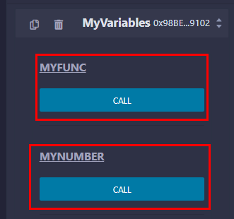
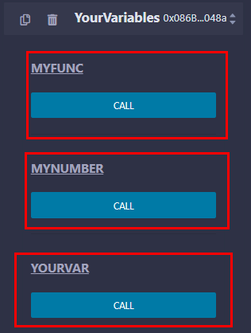
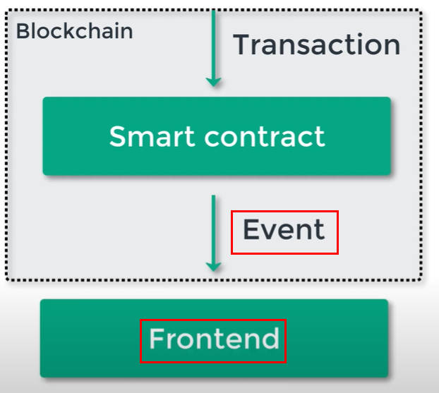
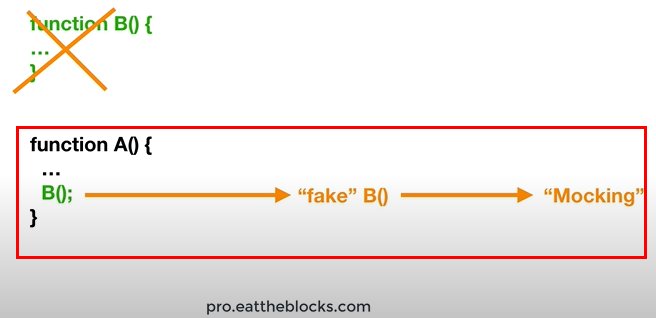
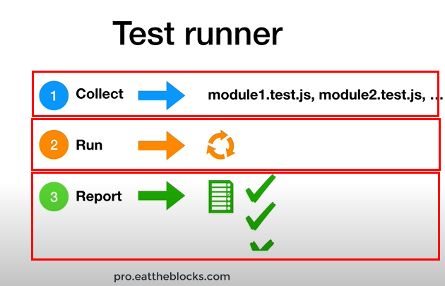
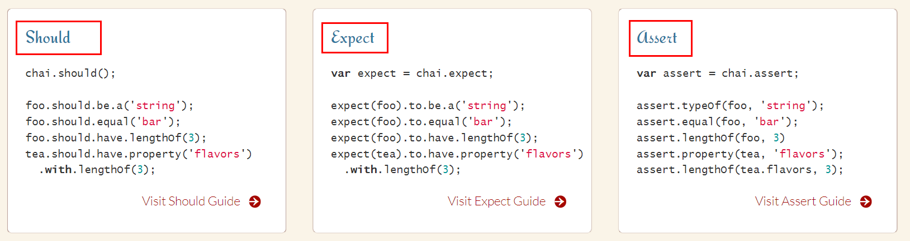

# Learning Solidity Essentials

Took below course and summarized essentials.

- [HashLips : Learn Solidity basics](https://www.youtube.com/watch?v=sngKPYfUgkc&list=PLvfQp12V0hS2PQd9-X-E2AjmXj1o05WOo&index=1&t=3178s)

## Solidity

> Solidity is an object-oriented, high-level language for implementing smart contracts. Smart contracts are programs which govern the behaviour of accounts within the Ethereum state. Solidity is a curly-bracket language. It is influenced by C++, Python and JavaScript, and is designed to target the Ethereum Virtual Machine (EVM).

```sol
// SPDX-License-Identifier: GPL-3.0
pragma solidity ^0.8.11; // this line is very important, clarifying compiler version.

// Emmet for natspac in VS Code : nat_contract
/// @title First solidity smart contract exercise
/// @author Jake Sung
/// @notice Explain to an end user what this does
/// @dev Explain to a developer any extra details
contract MyContract {
    string public name = "Jake Sung";

    function UpdateName(string memory _newName) public {
        name = _newName;
    }
}
```

> **With Solidity you can create contracts** for uses such as voting, crowdfunding, blind auctions, and multi-signature wallets.

> When deploying contracts, **you should use the latest released version of Solidity**. Apart from exceptional cases, only the latest version receives security fixes. Furthermore, breaking changes as well as new features are introduced regularly. We currently use a 0.y.z version number to indicate this fast pace of change.

### Ethereum virtual machine

> The Ethereum Virtual Machine or EVM is **the runtime environment for smart contracts in Ethereum**. It is not only sandboxed but actually completely isolated, which means that **code running inside the EVM has no access to network, filesystem or other processes**. Smart contracts even have limited access to other smart contracts.

### Convention

Naming in Solidity code is as follows :

- file name is in Camel Case, starting with upper case.
  

### Pragma

> A **pragma** is a compiler directive that allows you to provide additional information to the compiler. This information can change **compilation details** that are not otherwise under your control. For example, the pack pragma affects the layout of data within a structure. Compiler pragmas are also called directives.

Use below emmets to auto-generate Pragma and license identifier.

```
pragm
SPDX
```

### NatSpec Format

> Solidity contracts can use **a special form of comments** to provide rich documentation for functions, return variables and more. This special form is named the **Ethereum Natural Language Specification Format** (NatSpec). ... It is recommended that Solidity contracts are fully annotated using NatSpec for all public interfaces (everything in the ABI).


### Address

> The address type comes in two flavours, which are largely identical: 1) address: Holds a 20 byte value (size of an Ethereum address). 2) address payable: Same as address, but with the additional members transfer and send.

> The idea behind this distinction is that **address payable** is an address you **can send Ether to**, while a plain address cannot be sent Ether. Implicit conversions from address payable to address are allowed, whereas conversions from address to address payable must be explicit via payable(<address>).

### Reference types : struct, array, mapping

> If you use **a reference type, you always have to explicitly provide the data area** where the type is stored:

- memory (whose lifetime is limited to an external function call),
- storage (the location where the state variables are stored, where the lifetime is limited to the lifetime of a contract)
- calldata (special data location that contains the function arguments).

> Values of reference type can be modified through multiple different names. Contrast this with value types where you get an independent copy whenever a variable of value type is used. Because of that, reference types have to be handled more carefully than value types.

> **Every reference type** has an additional annotation, the **“data location”**, about where it is stored. There are three data locations: **memory, storage and calldata**.

#### Memory, storage, calldata

> Storage and Memory keywords in Solidity are analogous to Computer’s hard drive and Computer’s RAM. Much like RAM, Memory in Solidity is a temporary place to store data whereas Storage holds data between function calls. The Solidity Smart Contract can use any amount of memory during the execution but once the execution stops, the Memory is completely wiped off for the next execution. Whereas Storage on the other hand is persistent, each execution of the Smart contract has access to the data previously stored on the storage area.

> Every transaction on Ethereum Virtual Machine costs us some amount of Gas. The lower the Gas consumption the better is your Solidity code. The Gas consumption of Memory is not very significant as compared to the gas consumption of Storage. Therefore, it is always better to use Memory for intermediate calculations and store the final result in Storage.

### Function

#### Overriding

> Base functions can be overridden by inheriting contracts to change their behavior if they are marked as virtual. The overriding function must then use the override keyword in the function header. The overriding function may only change the visibility of the overridden function from external to public. The mutability may be changed to a more strict one following the order: nonpayable can be overridden by view and pure. view can be overridden by pure. payable is an exception and cannot be changed to any other mutability.

> Starting from Solidity 0.8.8, the override keyword is not required when overriding an interface function, except for the case where the function is defined in multiple bases.

#### Modifier

> Modifiers can be used to change the behaviour of functions in a declarative way. For example, you can use a modifier to automatically check a condition prior to executing the function.

> Modifiers are inheritable properties of contracts and may be overridden by derived contracts, but only if they are marked virtual

```solidity
modifier onlyOwner {
        require(
            msg.sender == owner,
            "Only owner can call this function."
        );
        _;
    }
```

#### Pure function

> Functions can be declared pure in which case they promise not to read from or modify the state. In particular, it should be possible to evaluate a pure function at compile-time given only its inputs and msg.data, but without any knowledge of the current blockchain state. This means that reading from immutable variables can be a non-pure operation.

#### Receive and fallback

> A contract can have at most one receive function, declared using receive() external payable { ... } (without the function keyword). This function cannot have arguments, cannot return anything and must have external visibility and payable state mutability. It can be virtual, can override and can have modifiers.

> The receive function is executed on a call to the contract with empty calldata. This is the function that is executed on plain Ether transfers (e.g. via .send() or .transfer()). If no such function exists, but a payable fallback function exists, the fallback function will be called on a plain Ether transfer. If neither a receive Ether nor a payable fallback function is present, the contract cannot receive Ether through regular transactions and throws an exception.

> Contracts that receive Ether directly (without a function call, i.e. using send or transfer) but do not define a receive Ether function or a payable fallback function throw an exception, sending back the Ether (this was different before Solidity v0.4.0). So if you want your contract to receive Ether, you have to implement a receive Ether function (using payable fallback functions for receiving Ether is not recommended, since it would not fail on interface confusions).

### Contract

> Contracts in Solidity are similar to classes in object-oriented languages. They contain persistent data in state variables, and functions that can modify these variables. Calling a function on a different contract (instance) will perform an EVM function call and thus switch the context such that state variables in the calling contract are inaccessible. A contract and its functions need to be called for anything to happen. There is no “cron” concept in Ethereum to call a function at a particular event automatically.

> One way to create contracts programmatically on Ethereum is via the JavaScript API web3.js. It has a function called web3.eth.Contract to facilitate contract creation.

#### Constructor

> When a contract is created, its constructor (a function declared with the constructor keyword) is executed once.

> A constructor is optional. Only one constructor is allowed, which means overloading is not supported.

> After the constructor has executed, the final code of the contract is stored on the blockchain. This code includes all public and external functions and all functions that are reachable from there through function calls. The deployed code does not include the constructor code or internal functions only called from the constructor.

### Error handling

> Solidity provides various functions for error handling. Generally when an error occurs, the state is reverted back to its original state. Other checks are to prevent unauthorized code access. Following are some of the important methods used in error handling −

1. assert(bool condition) − In case condition is not met, this method call causes an invalid opcode and any changes done to state got reverted. This method is to be used for internal errors.

1. require(bool condition, string memory message) − In case condition is not met, this method call reverts to original state. - This method is to be used for errors in inputs or external components. It provides an option to provide a custom message.

1. revert(string memory reason) − This method aborts the execution and revert any changes done to the state. It provides an option to provide a custom message.

### Library

> Libraries are similar to contracts, but their purpose is that they are deployed only once at a specific address and their code is reused using the DELEGATECALL (CALLCODE until Homestead) feature of the EVM. This means that if library functions are called, their code is executed in the context of the calling contract, i.e. this points to the calling contract, and especially the storage from the calling contract can be accessed.

> As a library is an isolated piece of source code, it can only access state variables of the calling contract if they are explicitly supplied (it would have no way to name them, otherwise). Library functions can only be called directly (i.e. without the use of DELEGATECALL) if they do not modify the state (i.e. if they are view or pure functions), because libraries are assumed to be stateless. In particular, it is not possible to destroy a library.

> Libraries can be seen as implicit base contracts of the contracts that use them. They will not be explicitly visible in the inheritance hierarchy, but calls to library functions look just like calls to functions of explicit base contracts.

## Basics

### State variable

Variables in solidity contract lie in blockchain and are called state variable.

```solidity
pragma solidity ^0.8.0;

contract MyVariables {
    uint256 number = 20; // state variable
    bool paused = true; // state variable
}
```

### Inheritance

Contracts in one solidity file can interact each other by inheritance. For example,

```
// SPDX-License-Identifier: MIT
pragma solidity ^0.8.0;

contract MyVariables {
    uint256 public myNumber = 20; // state variable, living forever with smart contract

    function myFunc() public view {
        // empty function
    }
}

// Inheritance in Solidity
contract YourVariables is MyVariables {
    uint256 public yourVar = 200;
}
```

Compile the above code and deploy it to Ganache blockchain. Then you can check below result.



Child contract can access to the parent contract's function and variables.



### Units and globally available varaibles

> Ether Units : A literal number can take a suffix of wei, gwei or ether to specify a subdenomination of Ether, where Ether numbers without a postfix are assumed to be Wei.

```js
assert(1 wei == 1);
assert(1 gwei == 1e9);
assert(1 ether == 1e18);
```

### Event

> Events are convenience interfaces with the EVM logging facilities.
> Solidity events give an abstraction on top of the EVM’s logging functionality. Applications can subscribe and listen to these events through the RPC interface of an Ethereum client.

```solidity
// SPDX-License-Identifier: GPL-3.0
pragma solidity >=0.4.21 <0.9.0;

contract SimpleAuction {
    // indexed keyword allows to use filter to search the event
    event Transfer(address indexed from, address indexed to, uint256 value);
}
```

> When you call them, they cause the arguments to be stored in the transaction’s log - a special data structure in the blockchain. These logs are associated with the address of the contract, are incorporated into the blockchain, and stay there as long as a block is accessible (forever as of now, but this might change with Serenity).

> The Log and its event data is not accessible from within contracts (not even from the contract that created them).



> Event can be readable outside of blockchain, for example in front end like above.

### Testing

Once smart contract is deploeyd on blockchain, the contract can't be changed unlike modern web application. This makes testing your contract before deployment crucial.

#### Test driven development

> Test-driven development (TDD) is a software development process relying on software requirements being converted to test cases before software is fully developed, and tracking all software development by repeatedly testing the software against all test cases.

> A key benefit of test-driven development is that it makes the developer focus on requirements before writing code. This is in contrast with the usual practice, where unit tests are only written after code.

Sequence of test driven development is as follows :

1. Add a test
1. Run all test. new tests should fail for expected reasons
1. Write the simplest code that passes the new test
1. All tests should now pass
1. Refactor as needed

#### Unit/Integration test

> A unit test is a way of testing a unit - the smallest piece of code that can be logically isolated in a system. In most programming languages, that is a function, a subroutine, a method or property. The isolated part of the definition is important.

In unit test, each unit being test should be isolated. For example, if function A includes function B inside, you should provide a fake function B(mocking) instead of real function B.



> Integration testing (sometimes called integration and testing, abbreviated I&T) is the phase in software testing in which individual software modules are combined and tested as a group. Integration testing is conducted to evaluate the compliance of a system or component with specified functional requirements.

#### Arrange-Act-Assert pattern

> Arrange-Act-Assert is a great way to structure test cases. It prescribes an order of operations.

1. Arrange : inputs and targets. Arrange steps should set up the test case. Does the test require any objects or special settings? Does it need to prep a database? Does it need to log into a web app? Handle all of these operations at the start of the test.

```js
const a = 1
const b = 2
```

1. Act : on the target behavior. Act steps should cover the main thing to be tested. This could be calling a function or method, calling a REST API, or interacting with a web page. Keep actions focused on the target behavior.

```js
const add = (a, b) => {
  return a + b
}
add(a, b)
```

1. Assert : expected outcomes. Act steps should elicit some sort of response. Assert steps verify the goodness or badness of that response. Assertions will ultimately determine if the test passes or fails.

```js
const result = add(a, b)
assert(result === 3)
```

#### What to test in contract

Things that should be tested in smart contract are as follows :

1. public functions
1. external functions
1. function with no visibility specified(publc by default)

#### Test runner

Mocha is a test runner which lets you know how the tests are going.



#### Chai

> Chai has several interfaces that allow the developer to choose the most comfortable. The chain-capable BDD styles provide an expressive language & readable style, while the TDD assert style provides a more classical feel.



## Remix

Remix is a online editor to compile Solidity. You can either go below website,

- [Remix IDE](https://remix.ethereum.org/)

or install extension in VS code.


> This project brings Remix plugins to Visual Studio Code. Remix plugins can perform a variety of tasks such as verifying contracts, linting, generating documentation, running tutorials, compiling, debugging and much more. The Remix Plugin API allows plugins that run in Remix to run in Visual Studio Code too.

Note that Remix tells us which execution would cost gas by color. If orange, cost gas. If not, not.

## Reference

- [Solidity official](https://docs.soliditylang.org/en/v0.8.11/)
- [VS Code marketplace : Ethereum Remix](https://marketplace.visualstudio.com/items?itemName=RemixProject.ethereum-remix)
- [Oracle : Pragmas](https://docs.oracle.com/cd/E19957-01/806-3571/Pragmas.html#:~:text=A%20pragma%20is%20a%20compiler,pragmas%20are%20also%20called%20directives.)
- [Storage vs Memory - Geeks for geeks](https://www.geeksforgeeks.org/storage-vs-memory-in-solidity/#:~:text=Much%20like%20RAM%2C%20Memory%20in,off%20for%20the%20next%20execution.&text=Function%20arguments%20are%20in%20memory.)
- [Solidity error handling - tutorialspoint](https://www.tutorialspoint.com/solidity/solidity_error_handling.htm)
- [Solidity Contract - Solidity official](https://docs.soliditylang.org/en/v0.8.11/contracts.html)
- [Eat the block - smart contract testing](https://www.youtube.com/watch?v=vLEB-YRukws&list=PLbbtODcOYIoHnn7pbX1fOeA8TopL1fpRL&index=1)
- [Automation Panda - ARRANGE-ACT-ASSERT: A PATTERN FOR WRITING GOOD TESTS](https://automationpanda.com/2020/07/07/arrange-act-assert-a-pattern-for-writing-good-tests/)
